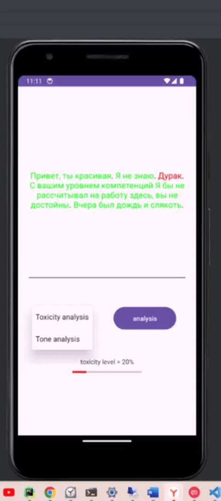

### Анализатор тональности текста

Андроид-приложение предоставляющее функции анализа эмоциональной тональности текста по меткам NEUTRAL, POSITIVE, NEGATIVE, а также токсичности текста.

Приложение использует ML-сервисы с натренированными под конкретную задачу классификации (тональности и токсичности соответственно) LLM.
**Это тестовый проект, работу приложения можно посмотреть только в Android-эмуляторе**

### Построение

#### 1. Клонируем репозиторий

```bash
git clone https://github.com/myPar/ToneAnalyzer.git
```

#### 2. Строим контейнеры с ML-сервисами

Переходим в папку _ToneAnalysisML_, и набираем следующую команду:
```bash
docker-compose build
```

Должен быть предварительно установлен и запущен [Docker Desktop](https://www.docker.com/products/docker-desktop/). ML-сервисы строятся в виде мульти-контейнерного приложения.

#### 3. Строим приложение

В AndroidStudio открываем папку с проектом: _ToneAnalysis_ и нажимаем _build_->_Make Project_

### Запуск

#### 1. Запуск ML-сервисов

Из папки _ToneAnalysisML_ запускаем:
```bash
docker-compose up
```

#### 2. Запуск приложения

Из AndroidStudio запускаем run _'app'_. В качестве эмулятора у меня выбран _Pixel 3a_



